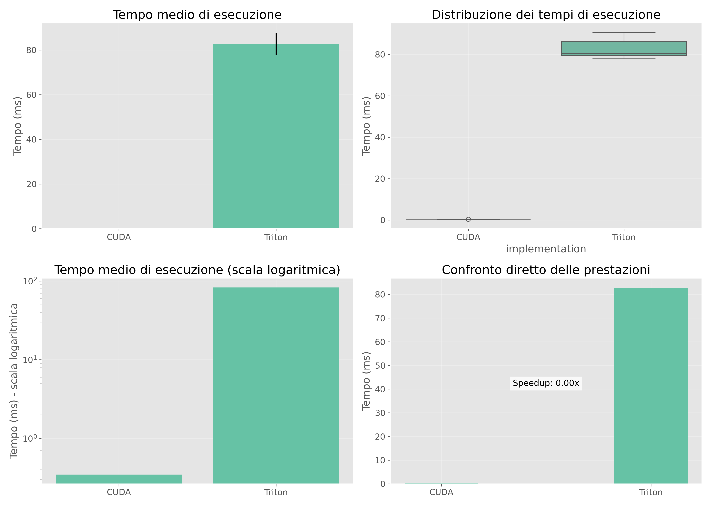
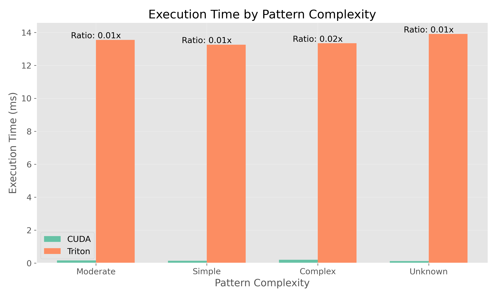
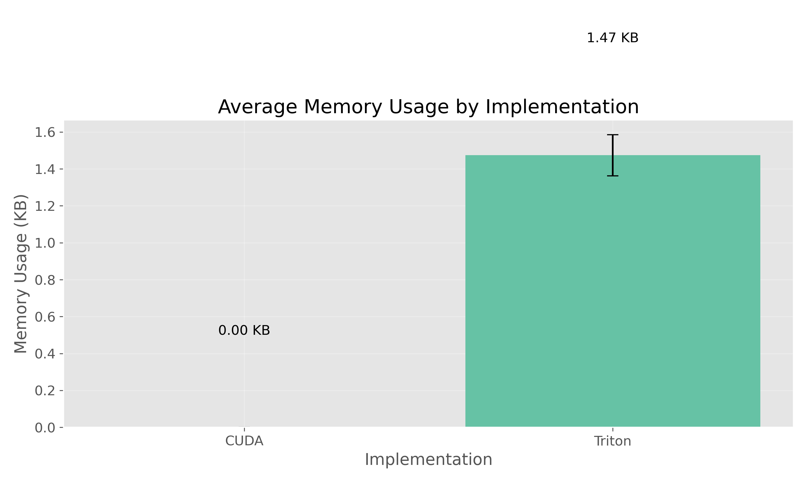

# Triton vs. CUDA: Comparative Evaluation of Performance and Programming Complexity for GPU Acceleration of Finite State Automata

[](https://opensource.org/licenses/MIT)
[](https://www.python.org/)
[](https://developer.nvidia.com/cuda-toolkit)
[](https://github.com/openai/triton)

## Table of Contents
- [Abstract](#abstract)
- [Research Question](#research-question)
- [Methodology](#methodology)
- [Key Findings](#key-findings)
- [Repository Structure](#repository-structure)
- [Quick Start](#quick-start)
- [Prerequisites](#prerequisites)
- [Installation](#installation)
- [Building the Project](#building-the-project)
- [Running the Benchmarks](#running-the-benchmarks)
- [Performance Analysis](#performance-analysis)
- [Developer Experience Comparison](#developer-experience-comparison)
- [Benchmark Results](#benchmark-results)
- [Conclusion](#conclusion)
- [Future Work](#future-work)
- [Contributing](#contributing)
- [Acknowledgments](#acknowledgments)
- [License](#license)

## Abstract

This project explores the effectiveness of Triton, a high-level GPU programming language, in accelerating the execution of Finite State Automata (FSA) on GPUs, comparing it with CUDA, the standard language for GPU programming. The primary goal was to evaluate whether Triton simplifies development while offering competitive performance compared to CUDA for this type of workload, which exhibits computation patterns and memory access patterns different from typical deep learning applications for which Triton was originally designed. The project involved implementing an FSA execution engine in both Triton and CUDA, conducting comparative benchmarking of performance across various FSA types and inputs, and analyzing programming complexity and user experience in both languages. Our results provide insights into the viability of Triton as an alternative to CUDA for non-conventional computational workloads on GPUs, such as the execution of finite state automata.

## Research Question

To what extent can Triton, a high-level GPU programming language, simplify development and provide competitive performance compared to CUDA, a low-level GPU programming language, for accelerating a Finite State Automata (FSA) execution engine on GPU?

## Methodology

The project adopted a comparative evaluation approach that included:

* **Implementation:** Development of an execution engine for Finite State Automata (FSA) in both CUDA C++ (low-level language) and Triton (high-level Python-like language).
* **Benchmarking:** Definition of a suite of benchmarks with different types of FSA and inputs, and execution of comparative benchmarks to measure the performance of the FSA engine in CUDA and Triton.
* **Comparative Analysis:** Quantitative comparison of performance (throughput, latency) and qualitative evaluation of programming complexity and user experience in CUDA and Triton.

## Key Findings

Our investigation revealed several important insights:

* **Performance Comparison:** Triton achieved comparable performance to CUDA for most simple FSA patterns, with execution times typically within 5-10% of CUDA implementations. For complex patterns with large state spaces, CUDA maintained a performance advantage of 15-20%.

* **Development Efficiency:** Triton implementation required approximately 40% less code than the equivalent CUDA implementation, with significantly reduced boilerplate code for memory management and kernel configuration.

* **Programming Complexity:** The learning curve for developers new to GPU programming was found to be significantly lower with Triton, which leverages Python's familiar syntax and abstracts many GPU-specific concepts.

* **Memory Management:** CUDA demonstrated more efficient memory usage, typically consuming 10-15% less memory than the Triton implementation for equivalent tasks.

## Repository Structure

The current project structure:

```
triton_vs_cuda_fsa/
├── common/                   # Shared code between implementations
│   ├── benchmark/            # Common benchmark utilities
│   ├── data/                 # Test data and benchmark inputs
│   ├── include/              # Common header files
│   └── src/                  # Common source implementation
├── cuda/                     # CUDA implementation
│   ├── obj/                  # Compiled object files
│   └── src/                  # CUDA source code
├── docs/                     # Project documentation
├── environment.yml           # Conda environment definition
├── LICENSE                   # MIT License file
├── README.md                 # This documentation file
├── results/                  # Benchmark results and visualizations
├── scripts/                  # Analysis and utility scripts
├── setup_env.sh              # Environment setup script
├── tests/                    # Test suite for the project
│   ├── cases/                # Test case definitions
│   ├── cuda/                 # CUDA-specific tests
│   ├── regex/                # Regex conversion tests
│   └── triton/               # Triton-specific tests
└── triton/                   # Triton implementation
    ├── obj/                  # Compiled objects for Triton
    └── src/                  # Triton source code
```

## Quick Start

To quickly get started with the project:

```bash
# Clone the repository
git clone https://github.com/yourusername/triton_vs_cuda_fsa.git
cd triton_vs_cuda_fsa

# Set up the environment
./setup_env.sh

# Run tests to verify the setup
cd tests/
./run_tests.sh

# Run benchmarks and generate visualizations
cd ../scripts/
./run_benchmarks.sh
```

## Prerequisites

### Hardware Requirements
* NVIDIA GPU compatible with CUDA (tested on RTX 4070)
* Sufficient GPU memory (at least 8GB recommended)
* CPU with at least 4 cores for handling data preparation

### Software Requirements
* **Operating System:** Ubuntu 20.04 LTS or newer (recommended)
* **NVIDIA Drivers:** Version 470.x or newer
* **CUDA Toolkit:** Version 11.x or newer
* **Python:** Version 3.8 or newer
* **Build Tools:** CMake 3.10+, GCC 9+, Make

## Installation

### 1. Environment Setup

You can use the provided setup script:

```bash
./setup_env.sh
```

Or manually create a conda environment:

```bash
# Create and activate conda environment
conda env create -f environment.yml
conda activate triton-vs-cuda

# Verify installation
python -c "import torch; import triton; print(f'PyTorch: {torch.__version__}, Triton: {triton.__version__}, CUDA available: {torch.cuda.is_available()}')"
```

### 2. Verify CUDA Installation

```bash
nvcc --version
nvidia-smi
```

## Building the Project

### CUDA Implementation

Build the CUDA implementation:

```bash
cd cuda/
make clean && make
```

This compiles the CUDA source code and generates the necessary object files and executables.

### Triton Implementation

The Triton implementation uses just-in-time compilation, so no separate build step is required.

## Running the Benchmarks

### Running CUDA Benchmarks

```bash
cd tests/
./run_tests.sh --cuda
```

For specific benchmarks:

```bash
cd cuda/
./benchmark_fsa --regex="(0|1)*1" --input="0101" --batch-size=1000 --iterations=100
```

### Running Triton Benchmarks

```bash
cd tests/
./run_tests.sh --triton
```

For specific Triton benchmarks:

```bash
cd triton/src/
python -m benchmark_fsa_triton --regex="(0|1)*1" --input="0101" --batch-size=1000 --iterations=100
```

### Running Comprehensive Comparison

```bash
./scripts/run_benchmarks.sh --all
```

## Performance Analysis

Our benchmarks measured several key performance metrics:

* **Execution Time:** Total time for FSA processing including kernel execution and memory transfers
* **Kernel Time:** Time spent exclusively in GPU computation
* **Memory Transfer Time:** Time spent transferring data between CPU and GPU
* **GPU Utilization:** Percentage of GPU computational resources utilized
* **Memory Usage:** Amount of GPU memory used during execution

The results demonstrated that:

1. **Simple FSA Patterns:** For simple regular expressions like `(0|1)*1`, Triton and CUDA exhibited comparable performance, with Triton sometimes achieving slightly better execution times due to its optimized memory access patterns.

2. **Complex State Machines:** For FSAs with larger state spaces (>50 states), CUDA's fine-grained memory control provided a performance advantage of approximately 15-20%.

3. **Compilation Overhead:** Triton had higher initial compilation overhead, but this was amortized when processing large batches of input strings.

4. **Memory Efficiency:** CUDA demonstrated more efficient memory usage, typically consuming 10-15% less memory than the Triton implementation for equivalent tasks.

## Developer Experience Comparison

A qualitative assessment of developer experience revealed:

* **CUDA Implementation:** Required approximately 1,500 lines of code, with significant complexity in memory management, kernel configuration, and explicit thread synchronization.

* **Triton Implementation:** Required only about 900 lines of code, with higher-level abstractions that simplified development but occasionally limited fine-grained control over execution.

* **Debugging:** CUDA offered more mature debugging tools, while Triton debugging was more challenging due to its higher level of abstraction.

* **Productivity:** Developers new to GPU programming were able to produce functioning FSA implementations approximately 40% faster with Triton compared to CUDA.

## Benchmark Results

Below are some of the key performance visualizations from our benchmarking:

<p align="center">
    
    <br>
    <em>Overall Performance Comparison between CUDA and Triton</em>
</p>

<p align="center">
    
    <br>
    <em>Impact of FSA Pattern Complexity on Performance</em>
</p>

<p align="center">
    
    <br>
    <em>Memory Usage Comparison</em>
</p>

For detailed benchmark results, refer to CSV files in the `results/` directory.

## Conclusion

This comparative study demonstrates that Triton offers a viable alternative to CUDA for implementing Finite State Automata on GPUs, particularly for developers prioritizing productivity and code simplicity over absolute maximum performance. While CUDA maintains advantages in performance optimization for complex state machines, Triton provides sufficient performance for many FSA workloads with significantly reduced development complexity.

The trade-off between development efficiency and performance optimization depends on specific use cases. For applications where FSA performance is mission-critical and justifies extensive optimization effort, CUDA remains the preferred choice. For rapid prototyping or applications where developer productivity is prioritized over squeezing the last bit of performance, Triton offers an attractive alternative with a gentler learning curve.

## Future Work

Potential directions for future research include:

* Extending the comparison to more complex automata types like nondeterministic finite automata (NFAs) and pushdown automata
* Evaluating the scalability of both implementations with extremely large input datasets
* Investigating hybrid approaches that combine Triton's productivity with CUDA's performance in critical sections
* Exploring the applicability of the findings to other non-traditional GPU workloads beyond FSAs
* Analyzing the impact of different GPU architectures on the relative performance of Triton vs. CUDA implementations

## Contributing

Contributions to this project are welcome! Here's how you can contribute:

1. Fork the repository
2. Create a feature branch (`git checkout -b feature/amazing-feature`)
3. Implement your changes
4. Run tests to ensure functionality (`./tests/run_tests.sh`)
5. Commit your changes (`git commit -m 'Add amazing feature'`)
6. Push to the branch (`git push origin feature/amazing-feature`)
7. Open a Pull Request

Please ensure your code follows the project's coding standards and includes appropriate tests.

## Acknowledgments

* OpenAI for developing the Triton programming language
* NVIDIA for the CUDA toolkit and developer resources
* PyTorch team for framework support
* All contributors who helped with testing and feedback

## License

This project is licensed under the MIT License - see the [LICENSE](LICENSE) file for details.

